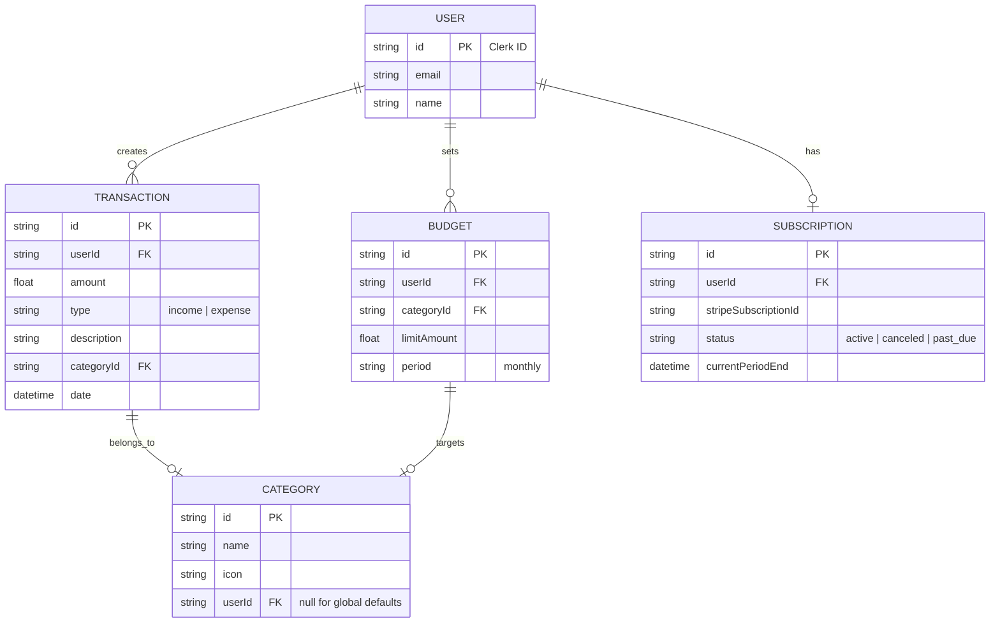

# Personal Finance SaaS App Implementation Plan

This document outlines the architecture, features, and implementation steps for a personal finance tracker. The app will feature a tiered subscription model (Free vs. Premium) powered by Stripe.

## Architecture & Tech Stack

- **Framework**: [Next.js](https://nextjs.org/) (App Router)
- **Language**: TypeScript
- **Authentication**: [NextAuth.js (Auth.js)](https://next-auth.js.org/) (Open-source and cost-effective)
- **Database**: [Supabase](https://supabase.com/) (Direct PostgreSQL and Supabase Client for simplified, free operations)
- **Payments**: [Stripe](https://stripe.com/) (Checkout & Customer Portal)
- **Styling**: [TailwindCSS](https://tailwindcss.com/) (Utility-first styling for fast, responsive design)
- **Analytics/Charts**: [Recharts](https://recharts.org/) (SVG-based charting library)
- **Validation**: [Zod](https://zod.dev/) (Schema-based validation)

---

## Proposed Features

### Core Management (Essential tracker features)
- **Transaction Dashboard**: Overview of recent spending and income.
- **Manual Entry**: Manually add income and expenses with descriptions.
- **Predefined Categories**: Access to standard categories like Food, Rent, Salary.
- **Search & Filter**: Basic search by description and filtering by date range.
- **Custom Categories (paid plan)**: Create and edit your own category names and icons.
- **Recurring Transactions (paid plan)**: Set up automatic entries for monthly bills or subscriptions.
- **Transaction Attachments (paid plan)**: Upload photos of receipts to transactions.

### Budgeting & Goals
- **Total Monthly Budget**: Set one overall spending limit for the month.
- **Category Budgets (paid plan)**: Set specialized budgets for specific categories (e.g., $200 for Groceries).
- **Savings Goals (paid plan)**: Create progress bars for specific savings targets (e.g., "Holiday Fund").
- **Budget Alerts (paid plan)**: Get notified when you reach 80% or 100% of a budget limit.

### Insights & Analytics
- **Spending Charts**: Basic pie chart showing spending by category for the current month.
- **Historical Trends (paid plan)**: Compare spending over months or years with line and bar charts.
- **Financial Forecast (paid plan)**: AI-powered estimation of end-of-month balance based on current spending.
- **Net Worth Tracker (paid plan)**: Aggregate your balance across multiple manually added "accounts".

### Data & Integration
- **Direct Link (paid plan)**: Link bank accounts directly via Plaid for automatic transaction sync.
- **CSV/PDF Export (paid plan)**: Download your financial data for external analysis or taxes.
- **Priority Support (paid plan)**: Direct contact for technical issues.

---

## Database Schema

---

## Stripe Integration Strategy

1. **Stripe Checkout**: Use pre-built Checkout pages for a secure and fast payment flow.
2. **Webhooks**: Implement a `/api/webhooks/stripe` endpoint to listen for `checkout.session.completed` and `customer.subscription.updated` events.
3. **Customer Portal**: Integrate Stripe Customer Portal to allow users to manage their subsciptions easily without custom UI.
4. **Subscription Guards**: Create a utility or middleware to check user subscription status before allowing access to Paid Tier features.

---

## UI/UX Design Direction

- **Theme**: Primarily **Light Mode** with a focus on whitespace and high-quality typography to maintain a minimalist feel.
- **Accent Color**: **Vibrant Blue** (`#3b82f6`) for primary buttons, active states, and selected icons.
- **Playfulness**: Subtle rounded corners (`border-radius: 1rem`), soft shadows, and micro-interactions (e.g., scale-up on hover) to add a friendly, modern touch.
- **Typography**: The **Outfit** sans-serif font family for a clean, playful, and modern look.
- **Layout**: Spacious cards with light grey borders (`#f3f4f6`) instead of heavy shadows for a neat, flat design.

---

## Library Overviews

### Recharts
**Recharts** is a composable charting library built with React and SVG. It provides pre-built components like `<BarChart />`, `<LineChart />`, and `<PieChart />` that are highly customizable. It’s perfect for SaaS apps because it handles responsive resizing and tooltips out of the box.

### Zod
**Zod** is a "TypeScript-first" validation library. You define a "schema" for your data (e.g., "this transaction must have a positive amount and a date"). Zod then ensures that data from users or APIs matches that schema exactly, preventing bugs and providing clear error messages to the UI.

---

## Verification Plan

### Automated Tests
- **Unit Tests**: Test finance calculation logic (budget vs preference) using Jest.
- **Integration Tests**: Verify Stripe webhook event parsing and database updates.
- **Linting**: Run `npm run lint` to ensure code quality.

### Manual Verification
1. **Authentication Flow**: Verify sign-up, sign-in, and profile management via Clerk.
2. **Transaction Management**: Manually add, edit, and delete transactions.
3. **Stripe Checkout**: Test the payment flow using Stripe's test card numbers.
4. **Access Control**: Ensure Free users are restricted from Paid features.
5. **Responsive Design**: Test on Desktop, Tablet, and Mobile views.
