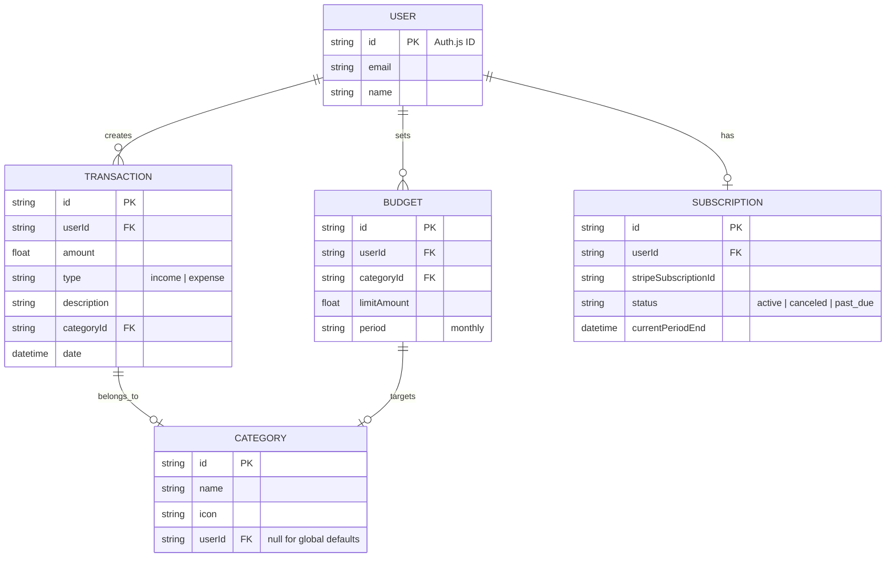

# Project Scope: Personal Finance SaaS

This document defines the scope, architecture, and development phases for the Personal Finance SaaS application, providing strict technical instructions for the implementation.

## 1. Project Overview
A modern, responsive web application for tracking personal finances, managing budgets, and gaining financial insights. The application uses a "freemium" model with Stripe integration for premium features.

## 2. Targeted Users
- **Free Users**: Individuals looking for a simple, manual way to track daily expenses and income.
- **Premium Users**: Power users requiring bank automation (Tink), advanced forecasting, detailed historical analytics, and receipt management.

## 3. Architecture & Tech Stack

- **Framework**: [Next.js](https://nextjs.org/) (App Router)
- **Language**: TypeScript
- **Authentication**: [Auth.js](https://authjs.dev/) (NextAuth v5) — Using Google and Email providers.
- **Database**: [Supabase](https://supabase.com/) — Direct PostgreSQL and Supabase Client.
- **Payments**: [Stripe](https://stripe.com/) — Checkout & Customer Portal.
- **Styling**: [TailwindCSS](https://tailwindcss.com/) — Utility-first styling for fast, responsive design.
- **State Management**: [Zustand](https://github.com/pmndrs/zustand) — Global UI state.
- **Analytics/Charts**: [Recharts](https://recharts.org/) — SVG-based charting library.
- **Validation**: [Zod](https://zod.dev/) — Schema-based validation.

---

## 4. UI/UX Design Direction

- **Theme**: Primarily **Light Mode** with a focus on whitespace and high-quality typography to maintain a minimalist feel.
- **Accent Color**: **Vibrant Blue** (`#3b82f6`) for primary buttons, active states, and selected icons.
- **Playfulness**: Subtle rounded corners (`border-radius: 1rem`), soft shadows, and micro-interactions (e.g., scale-up on hover) to add a friendly, modern touch.
- **Typography**: The **Outfit** sans-serif font family for a clean, playful, and modern look.
- **Layout**: Spacious cards with light grey borders (`#f3f4f6`) instead of heavy shadows for a neat, flat design.

---

## 5. Database Schema

---

## 6. Development Phases Plan

### Phase 1: Foundation & Authentication
Establish the core infrastructure and secure access.
- [x] **Infrastructure**: Next.js (App Router) project initialization with TailwindCSS and TypeScript.
- [ ] **Database**: Supabase PostgreSQL setup with the Supabase Client.
- [ ] **Authentication**: Auth.js implementation with Google and Email providers.
- [ ] **State Management**: Zustand for global UI state.

### Phase 2: MVP - Core Transaction Management
Implement the primary tracker features for basic users.
- [ ] **Dashboard**: Layout with responsive sidebar and main spending overview.
- [ ] **Transactions**: CRUD operations for manually adding income and expenses.
- [ ] **Categories**: System for default categories and category selection.
- [ ] **Search/Filter**: Filtering transactions by date, type, and keyword.

### Phase 3: Budgeting & Monitoring
Add tools for users to plan their spending.
- [ ] **Monthly Budget**: Interface to set a total monthly spending cap.
- [ ] **Budget Progress**: Visual progress bars showing "Budget vs. Actual".
- [ ] **Savings Goals (Premium)**: Creation and tracking of specific savings targets.
- [ ] **Alerts (Premium)**: UI notifications for budget thresholds at 80% and 100%.

### Phase 4: Analytics & Visualizations
Transform raw data into meaningful insights using Recharts.
- [ ] **Charts**: Pie charts for category spending and Bar charts for income vs. expense.
- [ ] **Historical Trends (Premium)**: Multi-month comparison charts.
- [ ] **Net Worth Tracker (Premium)**: Aggregated balance view across multiple manual accounts.
- [ ] **Forecasting (Premium)**: Statistical spending prediction logic based on historical averages.

### Phase 5: Monetization & External Integrations
Unlock the business model and automated features.
- [ ] **Stripe Integration**: Checkout flow for Premium upgrades and Customer Portal for subscription management.
- [ ] **Bank Sync (Premium)**: Tink API integration for automatic transaction fetching.
- [ ] **Data Portability (Premium)**: CSV and PDF export functionality for financial reports.
- [ ] **Receipt Uploads (Premium)**: Image upload support for transaction evidence.

### Phase 6: Launch Readiness & Polish
Final technical and UX refinements.
- [ ] **SEO**: Meta tags, OpenGraph images, and sitemap generation.
- [ ] **Performance**: Image optimization, code splitting, and database indexing.
- [ ] **Bug Squashing**: Comprehensive manual testing across devices.
- [ ] **Landing Page**: Conversion-focused home page highlighting features and pricing.

---

## 7. Stripe Integration Strategy

1. **Stripe Checkout**: Use pre-built Checkout pages for a secure and fast payment flow.
2. **Webhooks**: Implement a `/api/webhooks/stripe` endpoint to listen for `checkout.session.completed` and `customer.subscription.updated` events.
3. **Customer Portal**: Integrate Stripe Customer Portal to allow users to manage their subscriptions easily without custom UI.
4. **Subscription Guards**: Create a utility or middleware to check user subscription status before allowing access to Paid Tier features.

---

## 8. Library Overviews

### Recharts
**Recharts** is a composable charting library built with React and SVG. It provides pre-built components like `<BarChart />`, `<LineChart />`, and `<PieChart />` that are highly customizable.

### Zod
**Zod** is a "TypeScript-first" validation library. You define a "schema" for your data (e.g., "this transaction must have a positive amount and a date"). Zod ensures that data from users or APIs matches that schema exactly.

---

## 9. Technical Constraints & Out of Scope
- **Mobile Apps**: This scope is limited to a Progressive Web App (PWA); native iOS/Android apps are not included.
- **Manual Reconciliation**: Users must manually match bank transfers if not using bank sync.
- **Tax Filing**: The app provides reports but does not file taxes directly.

---

## 10. Verification Plan

### Automated Tests
- **Unit Tests**: Test finance calculation logic (budget vs preference) using Jest.
- **Integration Tests**: Verify Stripe webhook event parsing and database updates.
- **Linting**: Run `npm run lint` to ensure code quality.

### Manual Verification
1. **Authentication Flow**: Verify sign-up, sign-in, and profile management via Auth.js.
2. **Transaction Management**: Manually add, edit, and delete transactions.
3. **Stripe Checkout**: Test the payment flow using Stripe's test card numbers.
4. **Access Control**: Ensure Free users are restricted from Paid features.
5. **Responsive Design**: Test on Desktop, Tablet, and Mobile views.

---

## 11. Clarifications
1. **Tink Coverage**: Tink integration will prioritize all major Swedish banks (BankID supported).
2. **AI Forecasting**: Forecasting will use statistical linear regression based on the last 3 months of user data.
3. **Data Residency**: All data will be stored in Supabase's default region (AWS) unless a specific local requirement is provided.
